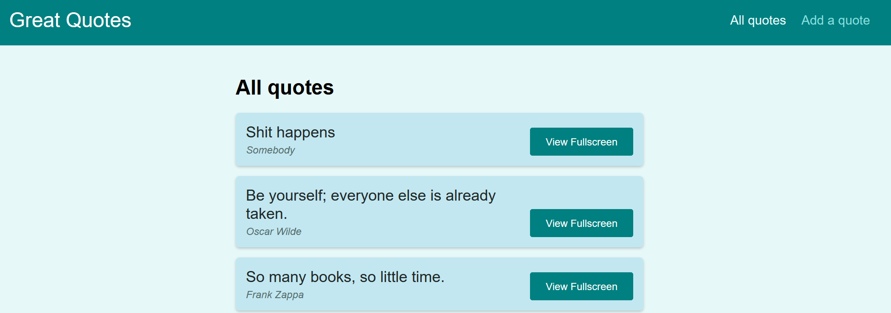

REACT Routing project II

---

In this repository, I'm practicing with ReactJs routing again. This time the project is to build a page with quotes. 
It will use routes to show a page with quotes details and a page with a form to add new quotes.  

This project makes use of many important router components, such as, useHistory, useParams, Redirect, Route, Switch, Prompt, etc..

It is a project by  @Maximilian Schwarzmüller (link to the course below) 

---

## Quotes page

### sorting the quotes

I'm using query parameters to sort the quotes. It can be done by the use of the useHistory hook.

Query parameters allows for optional information to be injected into the path. It's also very useful when it comes to sharing links. 
This allows the user to share the url the other person will enter the same page. 

    http://localhost:3000/quotes?sort=asc

to abstract the data from the query parameters, we'll use the URLSearchParams.

## Routes

        <Switch>
          <Route path='/' exact>
            <Redirect to='/quotes'/>
          </Route>
          <Route path='/quotes' exact>
            <Quotes/>
          </Route>
          <Route path='/quotes/:quoteId'>
            <QuoteDetail/>
          </Route>
          <Route path='/new-quote' >
            <NewQuote/>
          </Route>
          <Route path='*'>
            <PageNotFound/>
          </Route>
        </Switch>
